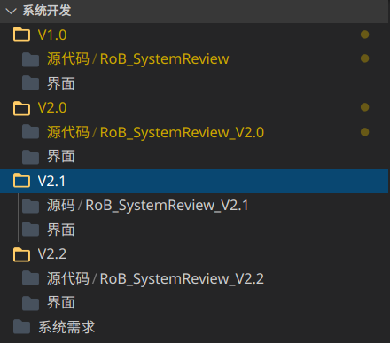

# 自动化偏倚风险评估系统

## 项目说明

这是一个自动化偏倚风险评估（Automated Risk of Bias Assessment）的演示

用Flask和Jinja2随便糊了个前端和后端

训练数据集是自己爬的Cochrane的文章，搜刮了一些随机对照试验（Randomized Controlled Trial, RCT）的文章构建了一点数据集，用BERT炼的丹

## 功能及界面演示


## 运行和调试

### 准备训练好的模型

如果自己训练了一份就把`data/model`里面的文件替换掉就好了

训练好的模型我放到`data/model`里面一份，由于TF-IDF那个模型的文件太大了，我放到release里面了

```bash
curl --create-dirs -O --output-dir ./data/model https://github.com/xi102/RoB_SystemReview/releases/download/v0.1.0/TF-IDF_vectors_model.m
```

### 修改相关配置

配置基本都直接扔在Start.py里面了

记得自行配置数据库

### 安装依赖

```bash
pip install -r requerements.txt
```

### 运行调试

```bash
python Start.py
```

请勿将此命令用于生产环境，默认设置开启Debug模式、端口5000，生产环境请自行关闭Debug并设置防火墙策略

## 各目录功能

```log
├── data
│   ├── model
│   ├── Processed_txt
│   ├── Txt_pre
│   └── Upload_pdf
├── dataProcess
│   ├── pdfProcess.py
│   ├── predict.py
│   ├── __pycache__
│   └── test.py
├── Form.py
├── LICENSE
├── Model.py
├── __pycache__
│   ├── Form.cpython-38.pyc
│   └── Model.cpython-38.pyc
├── README.md
├── Start.py
├── static
│   ├── css
│   └── img
└── templates
    ├── form_base.html
    ├── login.html
    ├── pre_result.html
    ├── register.html
    └── upload.html
```

data：存放相关文章和训练模型数据
dataProcess：文章处理和训练预测
static：css、js等静态资源
templates： 前端html等

## 关于

### 本项目相关文章

[夏渊.系统评价中自动化偏倚风险评估的相关算法研究[D].四川:电子科技大学,2020.](http://d.wanfangdata.com.cn/thesis/ChJUaGVzaXNOZXdTMjAyMDEwMjgSCUQwMTk2MzI3OBoIdmluMXhwcXo%3D)  
[基于 BERT 的自动化偏倚风险评价方法的研究](http://www.cjebm.com/article/10.7507/1672-2531.202006177)  

### 历史

2019-2020寒假，润润在做。我划水围观。

2020-2～2020-6 疫情在家，搞别的项目。润润被困湖北，我强势围观。

2020-7～2020-12 遗留骗钱项目，润润在湖北赶上疫情做了一半毕业跑路修福报去了，无人接手

2021-1 我将遗留的各版本整理成git仓库并放到github上了（以[102网吧](https://github.com/xi102)的名义）

2020-1 修了一点前端的小问题，调整一下Flask项目的目录结构，将python3.5和一堆老依赖依赖升到python3.8，相应的库（比如pdfminer）升到最新。

添加文档和注释，调整版本号

（python 3.9 改动比较大，像scikit-learn等库最高支持到3.8，暂时升不上去）

## 关于本仓库

[我](https://github.com/Archaeoraptor)整理了一下乱糟糟的公用工作站准备重装上面要停止维护的Ubuntu 16.04 LTS，清理归档各路祖传屎山和文件。陆续放出各路祖传代码和历史文物，这是其中之一。

这些祖传屎山基本都没怎么有注释和文档，也没有git或者svn之类的版本控制，包括这个。



这个已经算非常好的了，还有

还能跑的都尽力写了点文档并把依赖环境和运行方法附上了。


**大多数项目的质量都达不到生产环境的要求，请勿直接用于生产环境！**


初步整理于 2021年1月 ，未完待续